# Offset Bridge

A set of smart contracts and scripts that bridge funds from Solana to Polygon
and uses them to buy and retire carbon credits via Toucan.

The resultant Retirement Certificate is then bridged back to Solana.

## Process Description

1. Depositing into a token authority account on Solana
A token authority account is an account on Solana where users can deposit funds into that which go through the offset bridge to retire carbon credits. The token authority account is a PDA owned by the swap-bridge program and specified through a state account on Solana. Within the state account, a holding contract on polygon, to which the fund from solana will be bridged to, is specified. Each holding contract is generated for a specific NCT carbon project and a specific Solana wallet to which the retirement certificate will be stored at the end of the process.

Hence each token authority account corresponds to a specific carbon project and a specific Solana wallet. Therefore, each user should create their own token authority account if they would like the retirement certificate to be sent back to their own wallet.

2. Swapping into wrapped USDC (USDCpo)
The fund in the token authority account will then be swapped into USDCpo on a DEX (Jupiter is used currently). This is done such that the funds can be sent to Polygon to buy and retire NCT carbon credits, which are on the Polygon chain.

3. Bridging into a holding contract on Polygon
The USDCpo now in the token authority account will be sent to Polygon via the Wormhole bridge in this step. The bridged fund will land as USDC on the holding contract that is associated with the token authority account. Shall it happen that the user wish to bridge the funds existing in the token authority account to a different account on Polygon, it is possible with the signature of the update authority.

4. Retiring carbon credits
In this step the USDC now in the holding contract will be used to buy NCT carbon credits through a DEX (Sushi Swap is used in this step currently). The NCT carbon credits will then be sent to a retirement contract where TCO2 will be retired and a retirement certificate will be minted at the same time. The beneficiary of the retirement certificate is 

5. Bridging back to Solana
The retirement certificate will be bridged back to Solana to the wallet specified in the state account that is associated with the token authority account in the first step.

## UI
A user interface is available for going through the above process easily, the UI consists on the following pages:

1. Step 1 -- Select Account
In this page the user can connect with their own Solana and Polygon wallets. The Solana wallet should contain either the SOL or USDC which are going to be used to buy the NCT carbon tokens. The Polygon wallet should contain enough Matic for paying transaction fees needed in the later steps.

A default carbon project is displayed on screen but users can also pick their own carbon project to retire credits for by clicking the button `Change`. As of now, you can choose from multiple Toucan projects/carbon offsets. In the future, more projects from other third parties will be accessible via Sunrise Stake’s offset bridge.

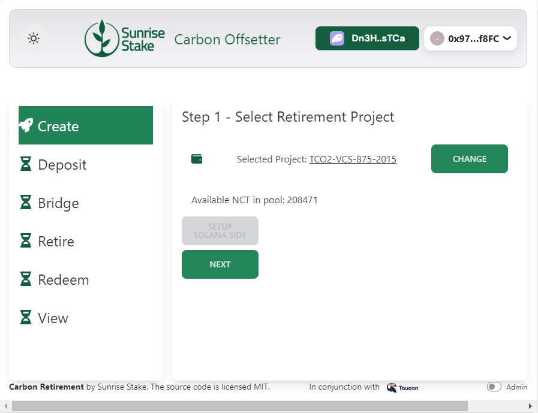
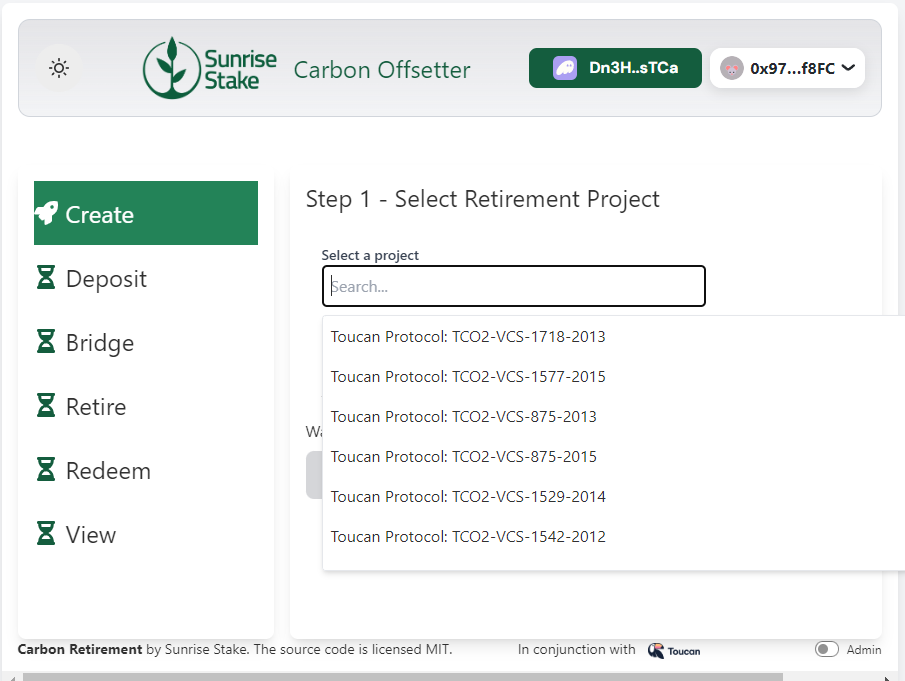

As an example, let us pick [VCS875 2015](https://registry.verra.org/app/projectDetail/VCS/875), a REDD+ (“_Reducing Emissions from Deforestation and forest Degradation_”) project which is also offered by Regen Network. Once you have selected a project, you can see how many credits are still available to be acquired and retired.

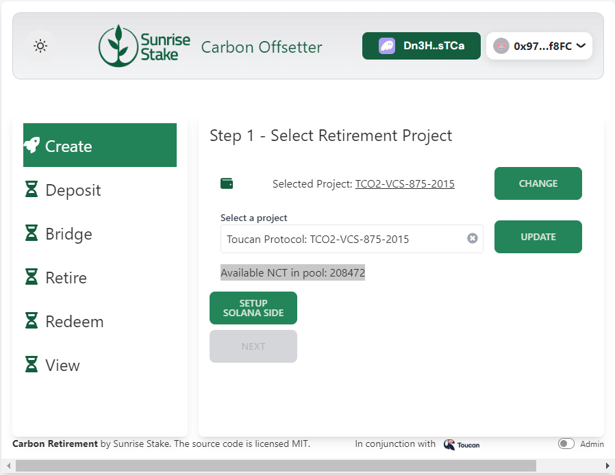

**As of now, the UI does not prevent you from committing more funds to a project, than it has credits left for you to retire and it is not possible to bridge left over funds back, so please double-check.** In future updates, the UI will prevent you from committing more funds than you can actually spend on any carbon project.

After the wallets are connected and the carbon project specified. User can click `Setup Solana side` to set up the token authority account (which is associated with a holding contract owned by the connected Polygon wallet).

2. Step 2 -- Deposit
In this page the user can choose to deposit either USDC or SOL into the token authority account. If you would like to specify the amount of metric tons of carbon you want to retire rather than the amount of SOL or USDC you would like to be spent, you can use the toggle and switch from “SOL” to “carbon”.

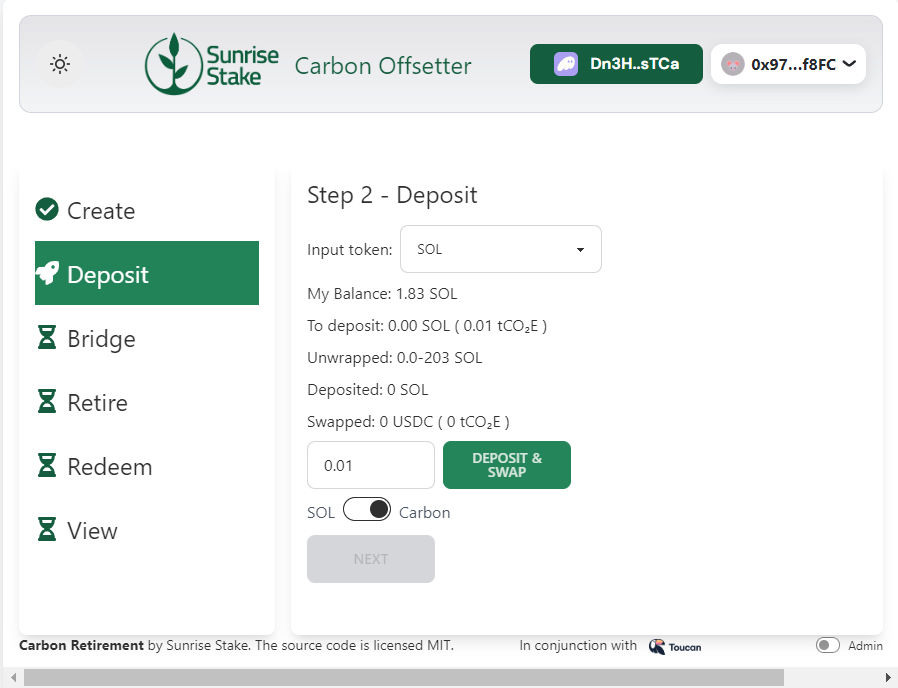

After specifying the amount of SOL/USDC to deposit, users can click `Deposit and Swap` to perform both the action of depositing the SOL/USDC from the Solana wallet to the token authority account and swapping the deposited amount into wrapped USDC (USDCpo) on the DEX (Jupiter). The amount of tCO2 that could be retired with the deposited amount  will be displayed in bracket.

Effectively, when you send funds into the state contract on Solana, you are committing them to solely be spent in the holding contract on Polygon. This holding contract specifies the respective carbon project you choose to retire carbon offsets against. Once you have committed funds to the state account on Solana, it can only be spent by the holding account on Polygon for the carbon project you have chosen.  

3. Step 3 -- Bridge
The total amount existing in the token authority account will be displayed on this page. The user can check if it's the expected amount before clicking `Bridge` to send the USDCpo from the token authority account to the bridge (Wormhole).

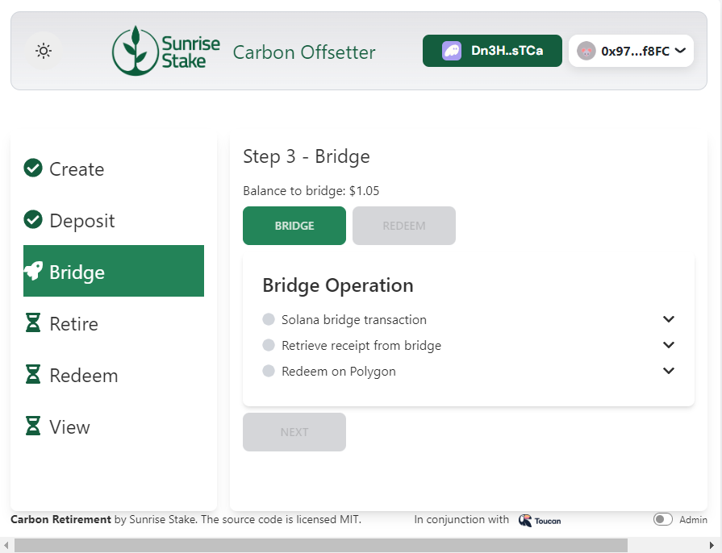

After the amount has been sent sucessfully to the bridge, the `Redeem` button will turn green and the user can then click on it to redeem the sent USDCpo onto the holding contract on the Polygon chain to finish the bridging action.

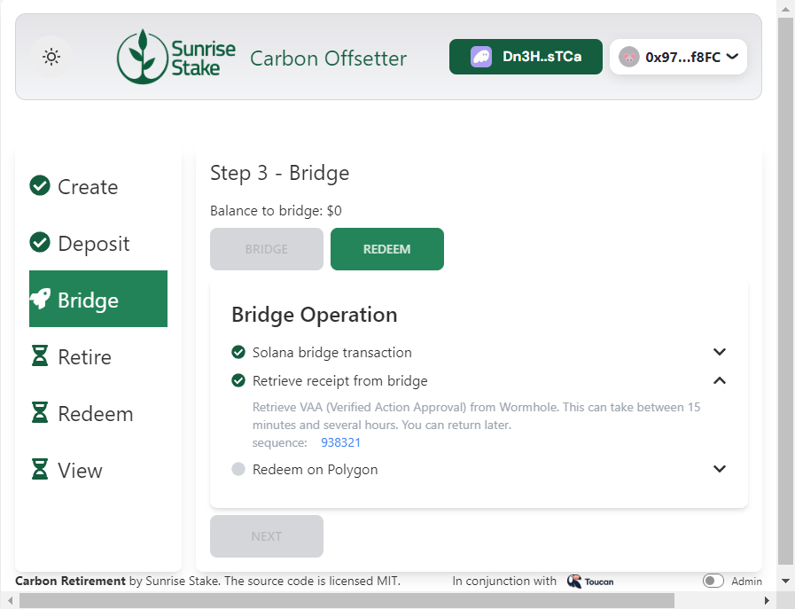

4. Step 4 -- Retire
Now that the USDCs are in the holding contract, it is ready to be used to retire carbon credit. In this page users would just need to click `Retire` and all the USDCs in the holding contract will be used to retire carbon credits from the selected carbon project in Step 1. An NFT will be minted at the same time that represent the retirement certificate.

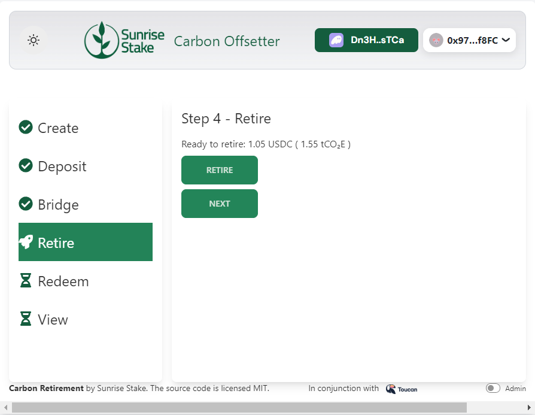

5. Step 5 -- Redeem Retirement Certificate
The retirement certificate can be bridged back to the user's Solana wallet. Similar to Step 3, the user would have to first click `Bridge` to send the NFT to the bridge and then once the NFT is sent to the bridge, the user can click the `Redeem` button to redeem it onto their Solana wallet.

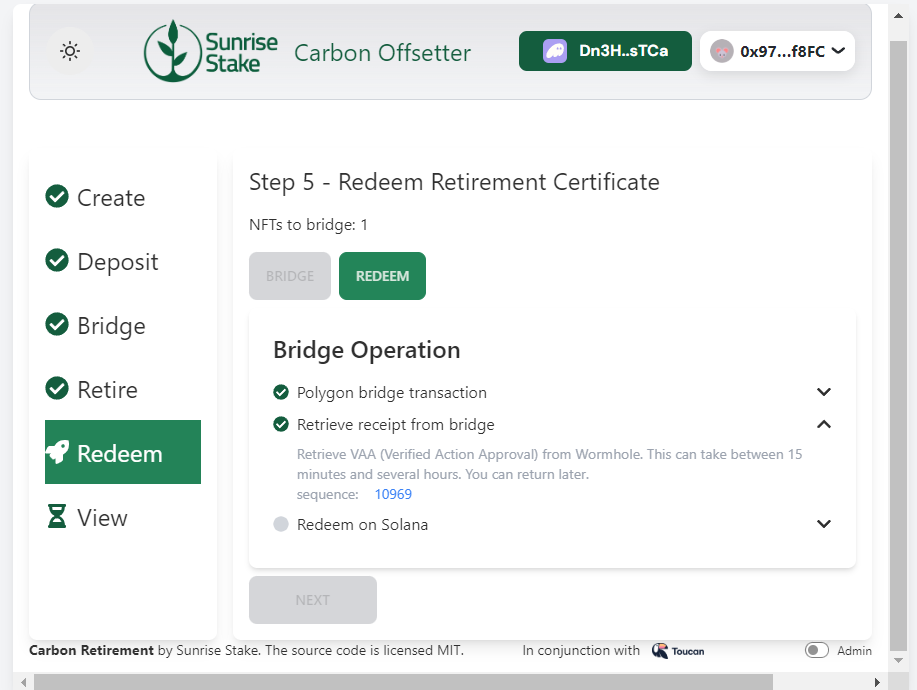

This might take a few minutes or hours, as Wormhole slows down bridging assets from Polygon for security reasons. After that, you can redeem the certificate on Solana by pressing the respective button and confirming the transactions in your Solana wallet and go to the last step by clicking “next”.

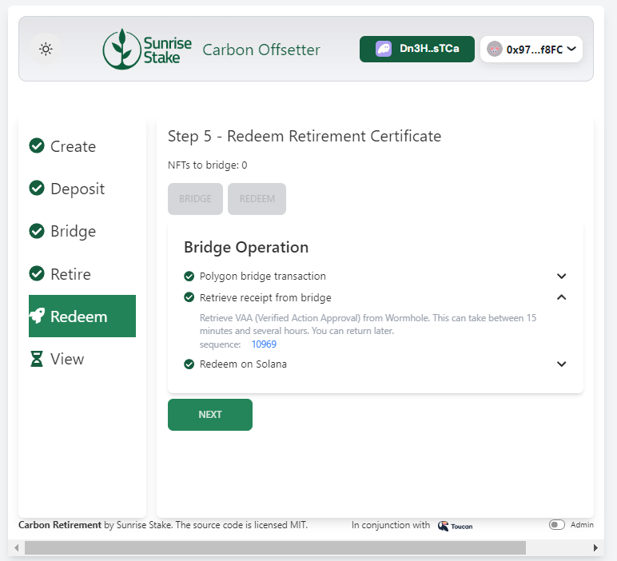

6. Step 6 -- Retirement Certificate
On this page all the exisiting Toucan retirement certificates in the user's Solana wallet will be displayed, a new retirement certificate should be shown after going through the above steps. To see the metadata of the retirement certificate, you can click on the hyperlink in the “View” page.

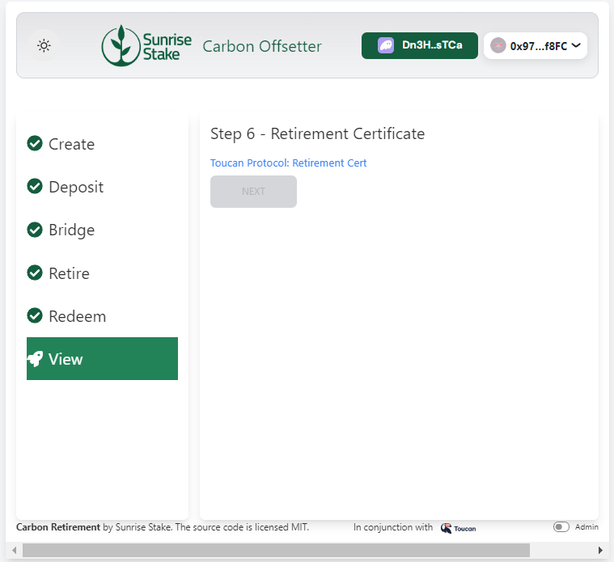
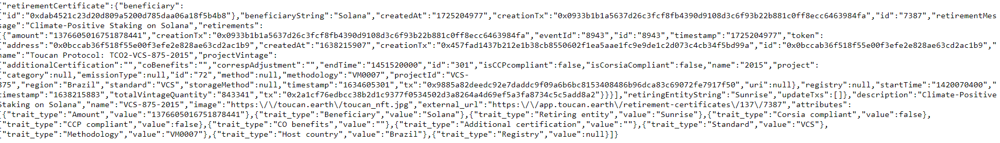

Congratulations! You have successfully offset some carbon and bridged the retirement proof onto Solana. 