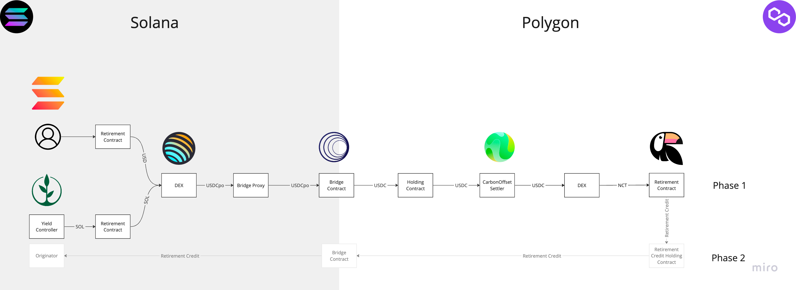

# Offset Bridge

A set of smart contracts and scripts that bridge funds from Solana to Polygon
and uses them to buy and retire carbon credits via Toucan.



The resultant Retirement Certificate is then bridged back to Solana.

## Instructions

Note: This is a work in progress, and these steps will change as the project evolves.

1. Initialize

```shell
yarn initialize
```

Sets up a new State on solana and derives a Token Authority PDA.
This should be done only once.

2. Wrap SOL

```shell
yarn wrap-sol
```

Transfers SOL to the Solana "Token Authority" PDA

NOTE: this step will later be moved into the smart contract, so you can simply call the smart contract with SOL.
NOTE 2: When paying with an SPL Token like USDC, this step can be skipped

3. Swap SOL for USDCpo

```shell
yarn swap
```

4. Bridge USDCpo to Polygon and receive USDC in Holding Contract

```shell
yarn bridge
```

5. Use the funds to retire carbon tokens on Toucan 
```shell
yarn retire
```